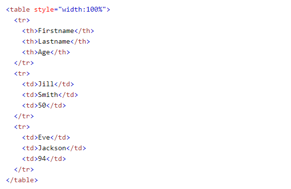

## What is HTML table tag?
* A Web page's HTML structure for constructing rows and columns. The Table tag specifies the overall table, whereas the Table Row (TR) tag specifies how each row is constructed. The real data is defined by the Table Data (TD) tag. Tables were commonly utilized for almost every element on the page prior to HTML5.

## Note 
* The table's data containers are the td> elements.
They can contain any HTML element, including text, graphics, lists, and other tables.

## HTML Table example :

## What is HTML table tags?

< table > Defines a table

< th >	Defines a header cell in a table

< tr >	Defines a row in a table

< td >	Defines a cell in a table

< caption >	Defines a table caption

< colgroup >	Specifies a group of one or more columns in a table for formatting

< col > 	Specifies column properties for each column within a **< colgroup >** element

< thead >	Groups the header content in a table

< tbody >	Groups the body content in a table

< tfoot >	Groups the footer content in a table
