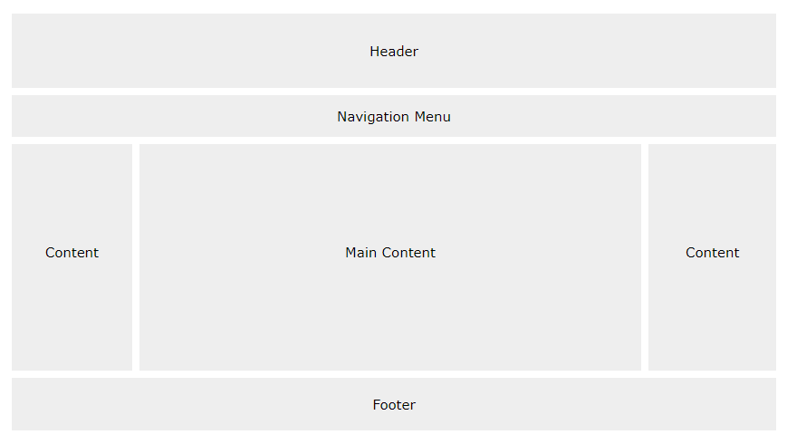

## What is meant by CSS layout?
* Cascading style sheets are used to format the layout of Web pages and are abbreviated as CSS. They can be used to define text styles, table sizes, and other characteristics of Web pages that were previously solely defined in the HTML of the page.

## What are three types of layouts CSS?
* CSS layout types: Fixed, Elastic, and Fluid.

## Website divide to 5 parts on CSS:

## What's Header? 
* The header of a website is usually seen at the top of the page (or right below a top navigation menu). 

## What's Navigation Bar?
* A navigation bar offers a list of links to assist visitors in navigating through your website. It frequently contains a logo or the website name.

## What's Content?
* The layout in this section, often depends on the target users.
1- column (often used for mobile browsers).
2- column (often used for tablets and laptops).
3- column layout (only used for desktops).
 
## What's footer?
* The footer is placed at the bottom of your page. It often contains information like copyright and contact info.

