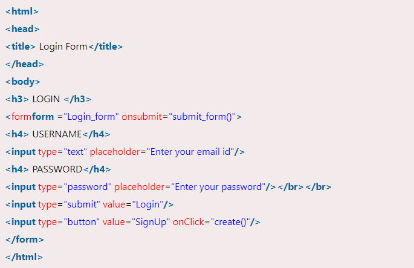
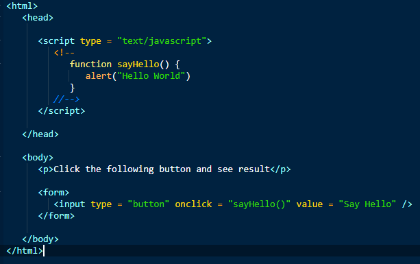
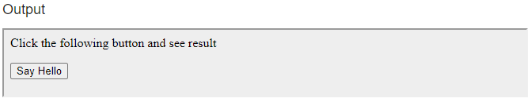

## What are forms in JavaScript?
* When a page is loaded, JavaScript creates an array forms in which all of the forms on the page are stored. Forms[0] is the first, followed by forms[1], and so on. Each form has an own array where JavaScript stores all of the form's elements. Elements[0] are the first, elements[1] are the second, and so on.

## Example:

* The form name tag is used to specify the form's name. "Login form" is the name of the form in this case. In the JavaScript form, this name will be referenced.
When a form is submitted, the action element specifies the action that the browser will take. We have taken no action in this area.
When the form is to be sent to the server, the method to take action can be either post or get. Each method has its own set of attributes and regulations.
The input type tag specifies the type of inputs that will be available in our form. We've set the input type to 'text,' which implies we'll type values into the textbox.
We've chosen 'password' as the input type, and password as the input value.
Next, we've set the input type to 'button,' which means that when we click it, the form's value is shown.

## Form Example:

## What is Events?
* The interaction between JavaScript and HTML is handled via events that occur when the user or the browser manipulates a page.
When a page loads, it is referred to as an event. When a user hits a button, it triggers an event. Other events include hitting any key, closing a window, resizing a window, and so forth.
Developers can use these events to run JavaScript coded replies, such as closing windows, displaying messages to users, validating data, and almost any other form of response imaginable.
The Document Object Model (DOM) Level 3 includes events, and every HTML element has a collection of events that can be used to trigger JavaScript code.

## Onclick Event Type Example:

## What is event reference?
* Each event is represented as an object based on the Event interface, which may include additional custom fields and/or functions to offer further information about what occurred.

