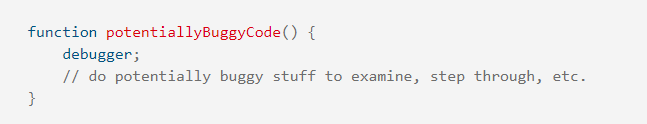

## What is debugging code?
* Programming code may contain syntactic or logical flaws; many of these errors are difficult to diagnose; yet, in many cases, nothing happens when programming code has errors. There are no error warnings, and there are no hints as to where to look for faults. Code debugging is the process of looking for (and repairing) errors in programming code.

## What is JavaScript Debuggers?
* Debugging is a difficult task. However, all current browsers come with a built-in JavaScript debugger that can be turned on and off, forcing problems to be notified to the user. You can also use a debugger to set breakpoints (points where code execution can be halted) and analyze variables while the code is running.

## Example:
* A debugger statement has been included into the following code to summon a debugger (if one exists) when the function is invoked.

## What are the top JavaScript debugging tools?

1. The Firefox JavaScript Debugger

2. Google Chrome Dev Tools

3. Opera Chromium Dev Tools

4. Edge Developer Tools

5. Safari Developer Menu
