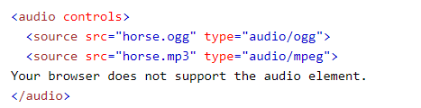
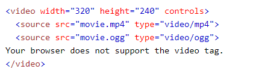

## What is audio in HTML?
* The audio> tag is used to embed sound material, such as music or other audio streams, into a document. One or more source> tags with distinct audio sources are included in the audio> tag. The browser will use the first source that it recognizes.

### Example:

## What is video in HTML?
* The video> element is used to include video content, such as a movie clip or other video streams, in a document. One or more source> tags with distinct video sources are included in the video> tag. The browser will use the first source that it recognizes. Only browsers that do not support the video> element will see the text between the video> and /video> tags. In HTML, three video formats are supported: MP4, WebM, and OGG.

### Example:

## What is image in HTML?
* An image is embedded in an HTML page using the img> tag. Images are linked to web pages rather than being physically put into them. src - Defines the image's location. If the image cannot be displayed for some reason, alt specifies an alternative text.

### Example:

