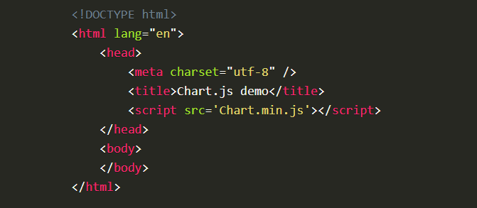
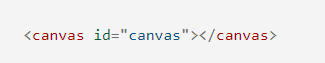
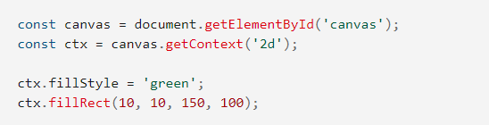

## What is charts in JS?
* Charts are significantly better at graphically displaying data than tables, and they have the extra virtue of never being forced into usage as a layout tool. They're easier to read and convey information fast, but they're not necessarily simple to make. It's a community-maintained open-source library (on GitHub) that makes it simple to visualize data using JavaScript. Chartist and Google Charts are comparable. It has eight different chart kinds (including bars, lines, and pies), all of which are responsive.

### Setting up Charts example:

### Drawing a line chart:

< canvas id="buyers" width="600" height="400">< /canvas > 

### Drawing a pie chart

< canvas id="countries" width="600" height="400">< /canvas > 

### Some types of charts:

1. Bar graph
All of the data and style properties of the bar graph are stored in the state variable. The dataset sub-set comprises information such as bar color, border width, and height of the bar, and the labels keyword adds names to each bar.
Bar /> is used to render the Bar component within the React App component. On line 22, the defined state is applied to the bar component. Additional design options, such as the position of the header and the chart legend, are available via the options property.

2. Graph with lines
The syntax is quite similar to that of a bar chart. LineTension is a new attribute that regulates the curvature of the line connecting the points.

## What is Canvas API?
* Using JavaScript and the HTML canvas> element, the Canvas API allows you to draw graphics. It's good for animation, game graphics, data visualization, photo manipulation, and real-time video processing, among other things. The Canvas API is mostly concerned with 2D graphics.

## Is Canvas API helpful?
Because you can now control the visuals, photos, and text dynamically with a scripting language, the CANVAS element allows you to add a lot more interaction to your web sites.

### Example:

