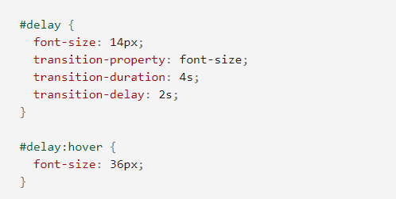

## What is CSS transforms?
CSS transforms change the shape and location of the impacted content without affecting the normal document flow by adjusting the coordinate space. This tutorial will teach you how to use transformations.

CSS transforms are created by applying affine linear transformations to HTML components using a collection of CSS properties. In both planar and 3D space, these transformations include rotation, skewing, scaling, and translation.

## What is CSS transforms properties?
CSS transformations are defined by two primary properties: transform and transform-origin are two terms for the same thing.

transform-origin
The origin's position is specified. It is at the middle of the element by default and can be moved. It's used by various transforms that require a specific point as a parameter, such as rotations, scaling, and skewing.

transform
The transforms that will be applied to the element are specified here. It's a list of transformations separated by spaces that are applied in the order required by the composition operation. In order to be successful, composite transforms must be applied from right to left.

## What is CSS transitions?
When modifying CSS properties, CSS transitions allow you to customize the animation speed. Rather than having property changes take effect instantly, you can have them happen over time. When you alter the color of an element from white to black, for example, the change is usually immediate, changes occur at time intervals that follow an acceleration curve when CSS transitions are enabled, all of which can be modified.

## Example:

## What is css animations?
Transitions from one CSS style configuration to another can be animated using CSS animations. A style describing the CSS animation and a series of keyframes indicating the start and finish states of the animation's style, as well as potential intermediate waypoints, make up an animation.

## What are the three key advantages to CSS animations?

1- They're simple to use for simple animations; you don't even need to know JavaScript to make them.

2- Even under moderate system load, the animations work well. In JavaScript, simple animations often run poorly. To make the performance as smooth as possible, the rendering engine can use frame-skipping and other approaches.

3- Allowing the browser to regulate the animation sequence allows the browser to improve performance and efficiency by limiting the update frequency of animations in tabs that aren't currently visible, for example.